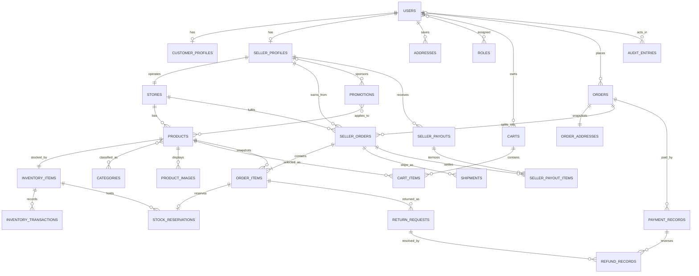

# Entity relationship diagram

The diagram emphasizes the marketplace transaction path. ASP.NET Identity support tables (`UserClaims`, `UserLogins`, `UserTokens`, `RoleClaims`) are omitted visually but remain in the migration and data dictionary.

Key cardinality: one customer order can span many sellers, but each `SellerOrder` belongs to exactly one store and seller. This prevents one seller from seeing or fulfilling another seller's items.
